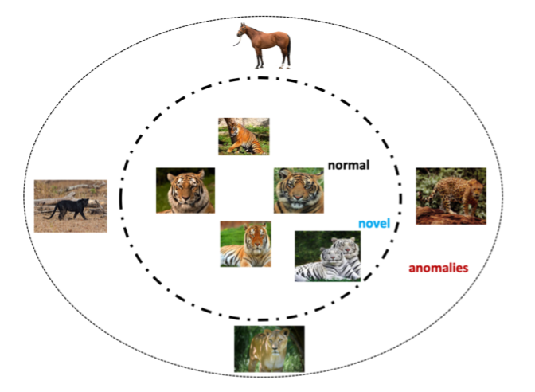

### Overview of Deep Learning in Anomaly Detection

----

This note is a rough summarize of anomaly detection, including the categorizations and algorithms. The main content of this note comes from this paper: [Deep Learning for Anomaly Detection: A Survey](https://arxiv.org/pdf/1901.03407.pdf). 

Considering the characteristics of medical images that my work focuses on, **semi-supervised** deep anomaly detection (DAD) is more useful. Instead of medical images, **video surveillance** and **industrial anomalies detection** are similar tasks that deserve attention.

#### Definition of outlier/anomaly

Outlier instances are observations that deviate so significantly from other observations as to arouse suspicion that it was generated by a different mechanism.

#### Anomaly vs Novelty

Anomalies are also referred as abnomalities, deviants or outliers in the data mining and statistics literature. Novelties are novel/new or unobserved patterns in the data. The white tiger is a novel instance and other animals are anomalies.

#### Categories of Anomaly Detection

- **Based on Nature of Input Data**

Input data can be  broadly classified into sequential (eg: voice, text, music, time series, protein sequences) or non-sequential data (eg: images, other data).  

- **Based on Availability of Labels**
  - **Supervised deep anomaly detection.** This is actually a kind of classification tasks. It's not popular due to the lack of labeled training samples. Sometimes, supervised anomaly detection is sub-optimal due to class imbalance (eg: medical images)
  
  - **Semi-supervised anomaly detection.** Semi-supervised DAD techniques are more widely adopted because the labels of normal instances are far more easy ot obtain than anomalies. Auto-encoders with reconstruction loss are a kind of popular semi-supervised DAD models.
  
  - **Unsupervised Deep Anomaly Detection.** Unsupervised DAD techniques detect outliers solely based on intrinsic properties of the data. Autoencoders are the core of all unsupervised DAD models.
- **Based on the Training Objective**
  - **Deep Hybrid Models (DHM).** DHM use deep nerual networks (usually AE) as feature extractor and input features into a traditional anomaly detection algorithm (eg: One-Class SVM)
  
  - **One-Class Neural Networks**
- **Based on the Type of Anomaly**
  - **Point anomalies.** The anomaly instance is a random isolated point without particular interpretation.
  - **Contextual anomaly detection.**  This anomaly instance is a data instance that could be considered as anomalous in some specific context. 
  - **Collective or group anomaly detection.** Each of the individual poins in isolation
  appears as normal data instances while observed in a group exhibit unusual
characteristics.
- **Miscellaneous Techniques**
  - Transfer learning based anomaly detection
  - Zero shot learning based anomaly detection
  - Ensemble based anomaly detection
  - Clustering based anomaly detection 
  - Deep reinforcement learning based anomaly detection
  - Statistical techniques deep anomaly detection

#### Applications of Deep Anomaly Detection

- **Instrusion Detection.** Host-based intrusion detection systems (HIDS), Net intrusion detection systems (NIDS)
- **Fraud Detection.** Banking fraud, Mobile cellular network fraud, Insurance fraud, Healthcare fraud
- **Malware Detection.**
- **Medical Anomaly Detection.** Two challenges: vast amount of imbalanced data and poor interpret-ability.
- **Social Networks.**
- **Log Anomaly Detection.**
- **Internet of things (IoT) Big Data Anomaly Detection.**
- **Industrial Anomalies Detection.** Damages in industry are rare events thus it can be modeled as anomaly detection.
- **Anomaly Detection in Time Series.**
- **Video Surveillance**

