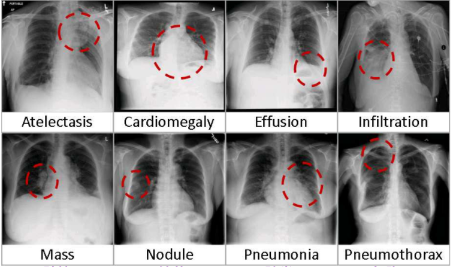
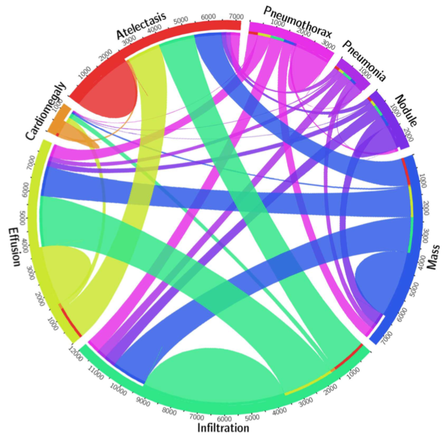
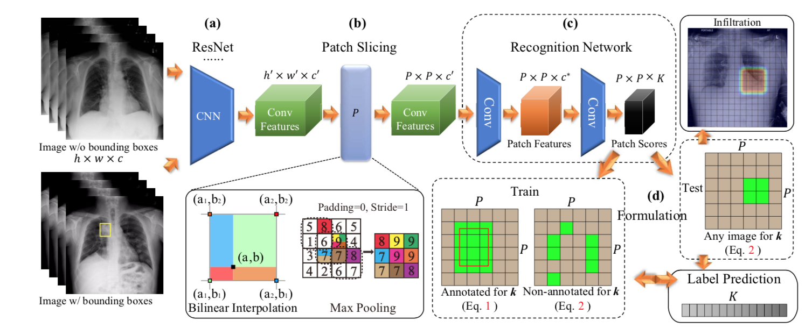
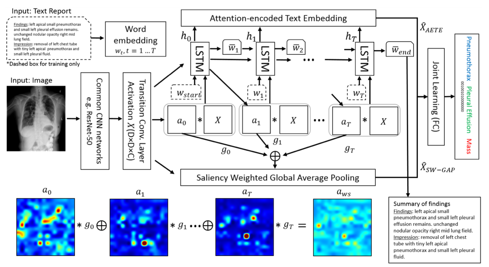

### Chest X-Ray

------

**Learning to Read Chest X-Rays: Recurrent Neural Cascade Model for Automated Image Annotation  CVPR2016**

**Summary**

This paper uses CNN-RNN model to automatically generate report texts from X-ray images. This model gives not only classification information but context such as localization, size. 

**Tricks**

There are some tricks to balance 17 classes: Batch normalization, randomly remove some normal images. This paper also shows merely duplicating classes with fewer images is more effective than augmenting them. But there is still heavily overfitting.

**ChestX-ray8: Hospital-scale Chest X-ray Database and Benchmarks on
Weakly-Supervised Classification and Localization of Common Thorax Diseases  CVPR2017**

**Introduction**

This paper proposed a new chest X-ray dataset called 'ChestX-ray8', comprising 108948frontal-view X-ray images of 32717 unique patients with text-mined eight disease image labels. Previous X-ray datasets usually consist of thousands of images. ChestX-ray8 can be used to evaluated previous algorithm on tens of thousands images. 

**Method**

This paper collects X-ray images from PACS from 1995 to 2012. The authors used mulitple NLP methods to mine labels from texts corresponding to these X-ray images. Considering the characteristics of medical texts, they defined many rules to improve the accuracy of their annotations and suppress false positive rate. They also evalued perfromance of many classical classification models on their dataset and generate CAM to evaluate the localization accuracy.

**Tricks**

- The intensity ranges of X-ray images are rescaled using the default window settings stored in the DICOM header files.

- Considering imbalance of different classes, they use weights according to the number of images of different classes in every batch instead of the whole dataset.

- They accumulate several iterations to back-propagate the gradients to enlarge the batch size.

- Hinge loss and LSE pooling are also discussed in this paper.

**Strengths** 

- The use of NLP methods to generate annotations is very novel and they propose specifically rules for medical texts.

- There are a small number of images with localization annotations in the form of bounding box.

- There are statistacal of the numbers of different diseases and their cooccurance.

**Weakness**

- The extraction of label automatically from texts means there is noise in this dataset.

- The model in this paper is simple and lack of novelty.

**Thoracic Disease Identification and Localization with Limited Supervision  CVPR2018**

**Introduction**

This paper proposed a novel multi-instance learning method to leverage large amount of images with image-level labels and small amount of images with image-level labels and localization labels. Two losses are introduced to address the two kind of labels. This paper gives a good evluation of image-level annotations and fine-grained ones.

**Method**

In order to classify 14 diseases in the dataset and localize them at the same time, this paper proposed a kind of multi-instance learning method. The input image is processed by the convolutional layers of ResNet and the last features are upsampled or downsampled to the size P x P. In this way, original images was divided into P x P patches and each pixel on the P x P features corresponds to one patch. The biggest benefit of this method is that the features of all patches are extracted at the same time, which is like Faster RCNN. In addition, the parameter P can be adjusted. Then these features of patches are processed by a few convolutional layers to the final shape P x P x K (K is the total number of classes). Thus every patch generates a K-dimension vector to denote whether there are diseases in this patch.

This paper designs two kind of loss functions. For images with bounding box annotations, the loss is $$p(y_k|x_i, bbox_i^k)=\prod_{j\in N} p_{ij}^k \cdot \prod_{j\in M\backslash N}(1-p_{ij}^k)$$

For those with out bounding box annotations, the loss function is 

$$p(y_k|x_i)=1-\prod_{j\in M}(1-p_{ij}^k)$$

The first function gives annotations to each patch using bounding box. The second function gives a kind of aggression method to utilize the supervision of image-level labels.

**Strengths**

- This paper proposed a novel multi-instance learning method and extract features of all patches at the same time.

- The loss designed for two types of data is reasonable.

- The use of smoothing image-level scores is a good trick in this method.

- This paper investigates the performance of their method when using different amounts of annotated data and unannotated data.

**Weaknesses**

- This paper uses some bounding box annotations while the compared method doesn't. It's not fair to compare the results.

- This paper uses pre-act ResNet as backbone while the comrade method only uses ResNet.

**TieNet: Text-Image Embedding Network for Common Thorax Disease Classification and Reporting in Chest X-rays  CVPR2018**

**Summary**

This paper uses a innovative framework to embed image and report text together to reach a better representation of the disease. This method reaches a high AUC in classification task and generates preliminary reports.

**Strengths:**

- This paper proposed a CNN-RNN architecture to embed text and image together.
- Several types of attention are used in this method to capture the tiny discriminative regions.
- Preliminary report can be generated by this framework.
- The method is evaluated on three different datasets.

**Weaknesses**

- There is no comparison with previous method that utilizes image and texts at the same time.
- The annotations of chest X-ray dataset are mined from medical reports. This may be a reasonal reason why the combination of text brings a great gain.
- Some notations are not well explained in this paper.